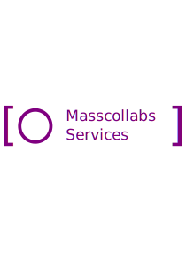

# Masscollabs Services Lead Logo(Wordmark + Logo)

# Our logo for subprojects of Masscollabs Services

This is the repository for masscollabs logos , pictures and wallpapers licensed under the terms of https://creativecommons.org/licenses/by-sa/4.0/ but the sun wearing sunglasses logo is under license public domain here is the source and web site : https://publicdomainvectors.org/en/free-clipart/Sun-with-sunglasses-vector-drawing/10662.html source : https://openclipart.org/detail/65395/sun-with-sunglasses-by-laobc

The meaning of the logo :

Why sun wears sunglasses at first it is meaningless but there is a metaphor that sun represents people and they wear sunglasses to see each other in other sense it is sharing ideas and making collaboration

The meaning of masscollabs :

mass collaborations see GNU Project, a free software, mass collaboration project at https://en.wikipedia.org/wiki/GNU_(disambiguation)
